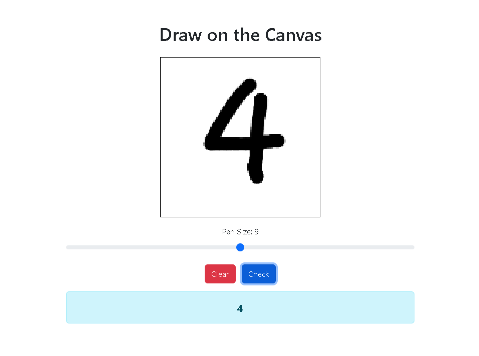
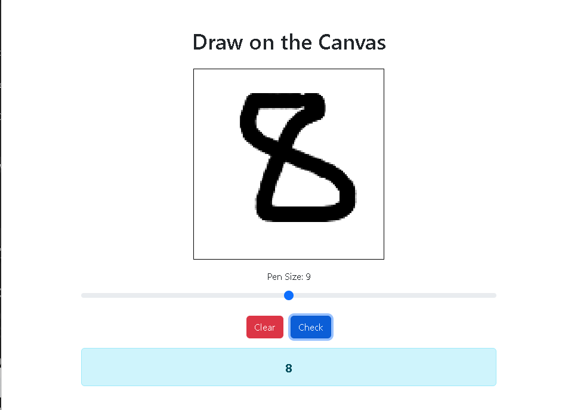
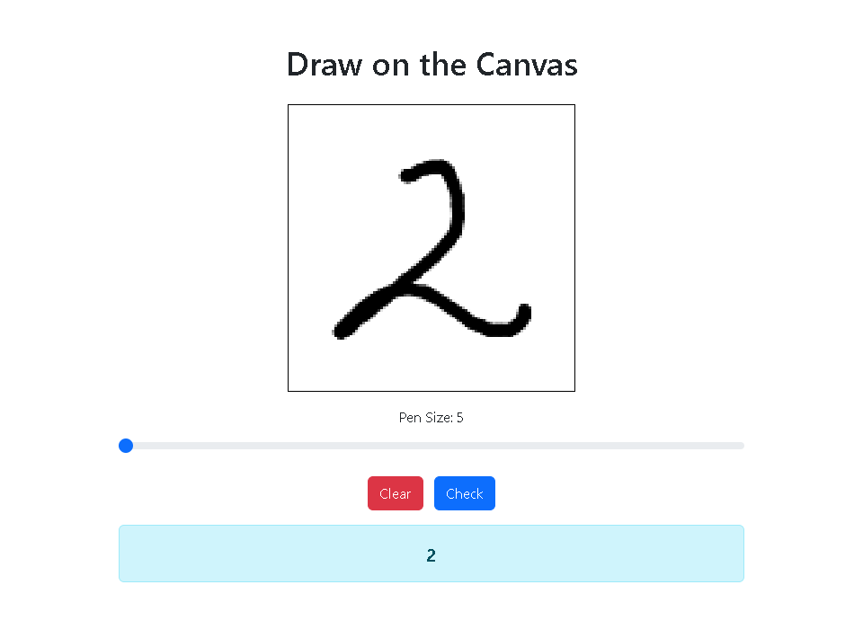

# Digit Recognition using Fine-tuned VGG16

## Table of Contents
- [Digit Recognition using Fine-tuned VGG16](#digit-recognition-using-fine-tuned-vgg16)
  - [Table of Contents](#table-of-contents)
  - [Introduction](#introduction)
  - [Technlogies](#technlogies)
  - [Features](#features)
  - [Exemples](#exemples)
  - [Installation](#installation)
  - [Contributing](#contributing)

## Introduction
This project involves fine-tuning the VGG16 model for digit recognition. Additionally, an interactive web application has been developed to utilize this model for real-time digit recognition.

## Technlogies

## Features
- Fine-tuned VGG16 model for high accuracy digit recognition.
- Interactive web application to draw and recognize digits.
- Easy-to-use interface for predictions.
## Exemples

## Installation

you can just double click `run_win.bat` for windows or `run_linux.sh` in linux

## Contributing
Contributions are welcome! Please submit a pull request or open an issue to discuss potential improvements or features.
